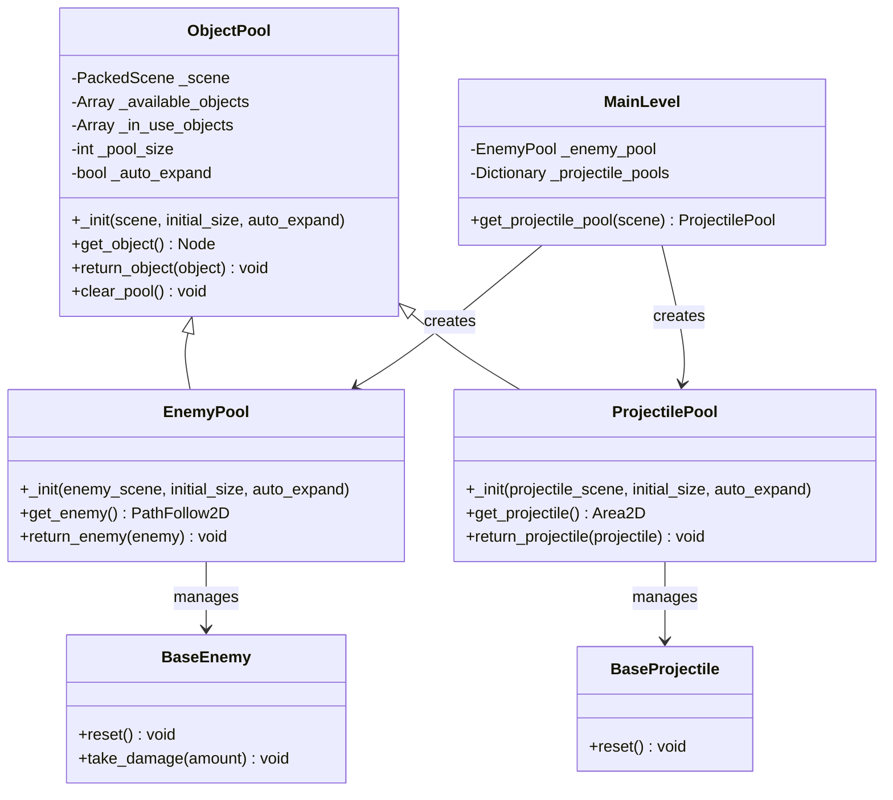

# Object Pooling Implementation Plan

## Overview

This document outlines the plan for implementing object pooling for enemies and projectiles in Project Unscripted to improve performance and memory management.

## What is Object Pooling?

Object pooling is a design pattern that pre-instantiates objects and keeps them in a "pool" for reuse, rather than creating and destroying objects repeatedly during gameplay. This reduces CPU overhead from frequent instantiation/destruction and helps prevent memory fragmentation.

## Current Implementation

Currently, the game:
- Instantiates new enemies directly in `main_level.gd` via `_on_spawn_timer_timeout()`
- Instantiates new projectiles directly in `base_tower.gd` via `_shoot()`
- Uses `queue_free()` to destroy objects when they're no longer needed

## Implementation Plan

### 1. Create a Generic ObjectPool Class

Create a reusable `ObjectPool` class that can manage any type of object:

```gdscript
# Systems/ObjectPool/object_pool.gd
class_name ObjectPool
extends Node

signal pool_empty

var _scene: PackedScene
var _available_objects: Array = []
var _in_use_objects: Array = []
var _pool_size: int
var _auto_expand: bool

func _init(scene: PackedScene, initial_size: int = 10, auto_expand: bool = true) -> void:
    _scene = scene
    _pool_size = initial_size
    _auto_expand = auto_expand
    _initialize_pool()

func _initialize_pool() -> void:
    for i in range(_pool_size):
        var object = _create_object()
        _available_objects.append(object)
        add_child(object)
        object.visible = false

func _create_object() -> Node:
    var object = _scene.instantiate()
    # Add a reference back to the pool for easy return
    object.set_meta("pool", self)
    return object

func get_object() -> Node:
    if _available_objects.is_empty():
        if _auto_expand:
            var object = _create_object()
            add_child(object)
            _in_use_objects.append(object)
            return object
        else:
            emit_signal("pool_empty")
            return null
    
    var object = _available_objects.pop_back()
    _in_use_objects.append(object)
    object.visible = true
    return object

func return_object(object: Node) -> void:
    if object in _in_use_objects:
        _in_use_objects.erase(object)
        _available_objects.append(object)
        object.visible = false

func clear_pool() -> void:
    for object in _available_objects + _in_use_objects:
        object.queue_free()
    _available_objects.clear()
    _in_use_objects.clear()
```

### 2. Implement Enemy Pooling System

Create a specialized pool for enemies that extends the generic pool:

```gdscript
# Systems/ObjectPool/enemy_pool.gd
class_name EnemyPool
extends ObjectPool

func _init(enemy_scene: PackedScene, initial_size: int = 10, auto_expand: bool = true):
    super(enemy_scene, initial_size, auto_expand)

func get_enemy() -> PathFollow2D:
    var enemy = get_object() as PathFollow2D
    if enemy:
        # Reset enemy state
        enemy.progress = 0
        if enemy.has_method("reset"):
            enemy.reset()
    return enemy

func return_enemy(enemy: PathFollow2D) -> void:
    return_object(enemy)
```

### 3. Implement Projectile Pooling System

Create a specialized pool for projectiles:

```gdscript
# Systems/ObjectPool/projectile_pool.gd
class_name ProjectilePool
extends ObjectPool

func _init(projectile_scene: PackedScene, initial_size: int = 15, auto_expand: bool = true):
    super(projectile_scene, initial_size, auto_expand)

func get_projectile() -> Area2D:
    var projectile = get_object() as Area2D
    if projectile and projectile.has_method("reset"):
        projectile.reset()
    return projectile

func return_projectile(projectile: Area2D) -> void:
    return_object(projectile)
```

### 4. Modify Enemy Spawning Code to Use the Pool

Update the `main_level.gd` script to use the enemy pool:

```gdscript
# In main_level.gd

# Add these variables
var _enemy_scene = preload("res://Project-Unscripted-Git/Entities/Enemies/test_enemy.tscn")
var _enemy_pool: EnemyPool

func _ready() -> void:
    # Initialize the enemy pool
    _enemy_pool = EnemyPool.new(_enemy_scene, 20)
    add_child(_enemy_pool)
    
    # Connect signals
    spawn_timer.timeout.connect(_on_spawn_timer_timeout)

func _on_spawn_timer_timeout() -> void:
    # Get an enemy from the pool instead of instantiating
    var enemy_instance = _enemy_pool.get_enemy()
    
    # Add the enemy to the path
    enemy_path.add_child(enemy_instance)
```

### 5. Modify Projectile Spawning Code to Use the Pool

Update the `base_tower.gd` script to use the projectile pool:

```gdscript
# In base_tower.gd

# Add this variable
var _projectile_pool: ProjectilePool

func _ready() -> void:
    # The existing code...
    
    # We'll initialize the pool in the main level and access it here

func _shoot() -> void:
    if not data.projectile_scene:
        return
    
    # Get the projectile pool from the main level
    if not _projectile_pool:
        var main_level = get_tree().get_nodes_in_group("main_level")[0]
        _projectile_pool = main_level.get_projectile_pool(data.projectile_scene)
    
    # Get a projectile from the pool
    var projectile = _projectile_pool.get_projectile()
    if not projectile:
        return
    
    # Configure the projectile
    projectile.target = _current_target
    projectile.speed = data.projectile_speed
    projectile.damage = data.projectile_damage
    projectile.global_position = muzzle.global_position
    projectile.visible = true
```

### 6. Add Pool Initialization in the Main Level

Update the `main_level.gd` script to initialize and manage all the pools:

```gdscript
# In main_level.gd

# Add these variables
var _projectile_pools = {}

# Add this function to get or create a projectile pool for a specific scene
func get_projectile_pool(projectile_scene: PackedScene) -> ProjectilePool:
    var scene_path = projectile_scene.resource_path
    if not _projectile_pools.has(scene_path):
        var new_pool = ProjectilePool.new(projectile_scene, 30)
        add_child(new_pool)
        _projectile_pools[scene_path] = new_pool
    return _projectile_pools[scene_path]
```

### 7. Update Enemy and Projectile Lifecycle Management

Modify the `base_enemy.gd` and `base_projectile.gd` scripts to work with the pooling system:

For `base_enemy.gd`:
```gdscript
# Add this function to reset the enemy state
func reset() -> void:
    if data:
        _current_health = data.max_health
        if is_instance_valid(health_bar):
            health_bar.update_health(_current_health, data.max_health)
            health_bar.visible = false

# Modify the queue_free calls to return to pool instead
func take_damage(damage_amount: float) -> void:
    # Existing code...
    
    if _current_health <= 0:
        # Return to pool instead of queue_free
        var pool = get_meta("pool") if has_meta("pool") else null
        if pool:
            get_parent().remove_child(self)
            pool.return_enemy(self)
        else:
            queue_free()

func _process(delta: float) -> void:
    # Existing code...
    
    if progress_ratio >= 1.0:
        # Return to pool instead of queue_free
        var pool = get_meta("pool") if has_meta("pool") else null
        if pool:
            get_parent().remove_child(self)
            pool.return_enemy(self)
        else:
            queue_free()
```

For `base_projectile.gd`:
```gdscript
# Add this function to reset the projectile state
func reset() -> void:
    target = null

# Modify the queue_free calls to return to pool instead
func _physics_process(delta: float) -> void:
    # If the target is gone, return the projectile to the pool
    if not is_instance_valid(target):
        var pool = get_meta("pool") if has_meta("pool") else null
        if pool:
            get_parent().remove_child(self)
            pool.return_projectile(self)
        else:
            queue_free()
        return
    
    # Existing code...

func _on_area_entered(area: Area2D) -> void:
    # Existing code...
    
    # Return to pool instead of queue_free
    var pool = get_meta("pool") if has_meta("pool") else null
    if pool:
        get_parent().remove_child(self)
        pool.return_projectile(self)
    else:
        queue_free()
```

### 8. Test and Optimize the Pooling System

After implementing the object pooling system:

1. Test with different pool sizes to find the optimal balance
2. Add debugging tools to monitor pool usage
3. Implement pool expansion strategies based on gameplay needs
4. Add visual indicators for debugging (optional)

## Implementation Considerations

1. **Memory vs. Performance Trade-off**: Object pooling trades memory for performance. We pre-allocate objects to avoid the cost of instantiation during gameplay.

2. **Pool Size Management**: Start with reasonable pool sizes and adjust based on testing. For enemies, consider the maximum number that might be active at once. For projectiles, consider fire rate and projectile lifetime.

3. **Auto-expansion**: The pools can automatically expand if needed, but this should be monitored to prevent excessive memory usage.

4. **Scene Structure**: The pooled objects will be children of the pool nodes, which might require adjustments to your scene hierarchy.

5. **Debugging**: Consider adding debug visualization to monitor pool usage during gameplay.

## System Architecture Diagram



## Expected Benefits

1. **Improved Performance**: Reduced CPU overhead from frequent instantiation/destruction
2. **Reduced Memory Fragmentation**: Fewer allocations/deallocations means less memory fragmentation
3. **Smoother Gameplay**: Fewer frame rate drops during intense gameplay with many enemies and projectiles
4. **Better Memory Management**: More predictable memory usage patterns